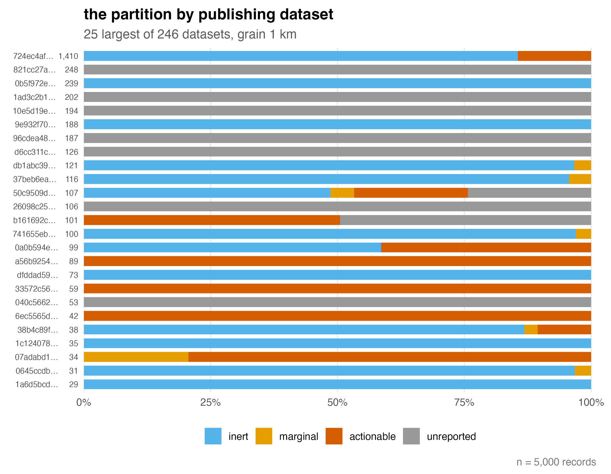

# ingrain <a href="https://anonymous.github.io/ingrain/"></a>

[](https://github.com/anonymous/ingrain/actions/workflows/R-CMD-check.yaml)

Which of your occurrence records can a positional-uncertainty correction
actually touch -- at *your* analysis resolution?

Filters and corrections for coordinate uncertainty act only on some
records, and which ones depends on the grain of the intended analysis.
`ingrain` classifies every record in an occurrence table into four
states relative to a chosen raster cell edge length *R*, before any
model is fitted:

* **inert** (*r* ≤ *R*/2) -- the uncertainty disc fits within a cell;
  corrections cannot act.
* **marginal** (*R*/2 < *r* ≤ 3*R*) -- the boundary band.
* **actionable** (*r* > 3*R*) -- corrections have room to act, and the
  choice among them has consequences.
* **unreported** (*r* is `NA`) -- no correction can act, and the radius
  cannot be recovered from the coordinates.

`ingrain` audits; it deliberately does not clean. Run it after standard
coordinate cleaning (e.g. CoordinateCleaner, bdc) and before modelling.

## Installation

```r
# install.packages("remotes")
remotes::install_github("anonymous/ingrain")
```

## Quick start

```r
library(ingrain)

a <- ingrain(crayfish, grain = 1000)
a
autoplot(a)
```


```r
p <- ingrain_profile(crayfish, mark = 1000)
autoplot(p)
```


The grey band is flat by construction: it is the share of the data that
no choice of resolution can touch. The steps in the coloured bands are
real, not artefacts -- reported radii cluster at publisher conventions
(301 m, 1 km, 5 km, ...), and the classification thresholds cross those
mass points as the grain sweeps.

The audit can also be cut by publisher:

```r
bd <- by_dataset(a)
ingrain_u(a, seed = 1)
autoplot(bd)
```



Most datasets sit almost entirely in one state -- publishers occupy
regimes, not a gradient -- and `ingrain_u()` quantifies how much the
dataset determines a record's state: the uncertainty coefficient of the
state given the dataset, read against a permutation null.

## Bundled data

`crayfish` is a fixed random sample of 5,000 crayfish occurrence
records, drawn from the 507,980-record GBIF occurrence download
[doi:10.15468/dl.99ezk2](https://doi.org/10.15468/dl.99ezk2) and
restricted to CC0/CC BY records to permit redistribution. The sample
is registered as GBIF derived dataset
[doi:10.15468/dd.d9xgfc](https://doi.org/10.15468/dd.d9xgfc), which
credits all 246 contributing datasets. It exists to
demonstrate the package mechanics; do not use it for ecological
inference.

## Status

Under active development towards a software paper; the API may change
until v0.1.0.
