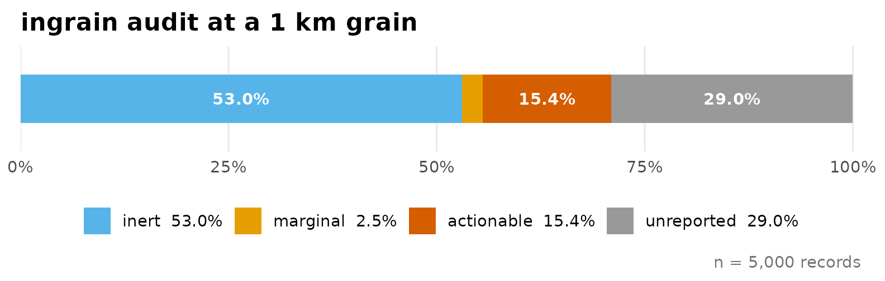
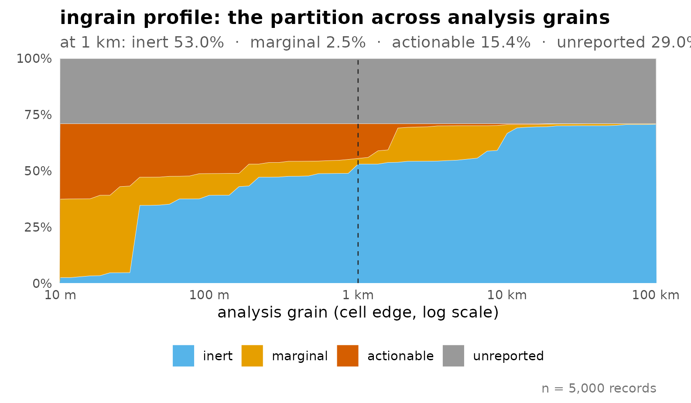
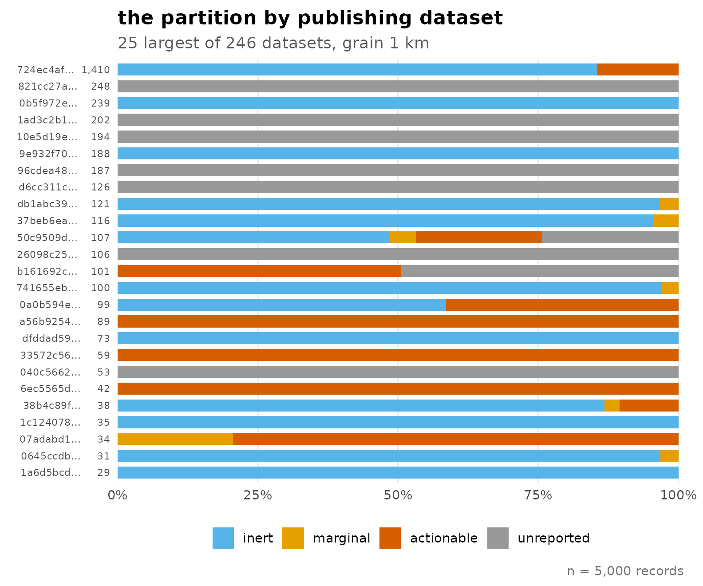

# From a GBIF download to a defensible dataset

``` r

library(ingrain)
```

## The question the audit answers

A GBIF download carries a per-record positional uncertainty radius,
`coordinateUncertaintyInMeters`, reported for some records and missing
for others. Coordinate-cleaning tools flag impossible and suspicious
coordinates; what they do not say is what the *reported uncertainty*
means for the analysis you are about to run. A widespread workflow idiom
keeps records whose radius is below a threshold *or* missing, and drops
the rest – a filter that selects on which publishers reported metadata,
not on where the organisms were.

`ingrain` asks a different question, record by record: **at your
analysis resolution, can an uncertainty-aware treatment act on this
record at all?** For a raster with cell edge length *R* and a reported
radius *r*, every record lands in one of four states:

- **inert** (*r* ≤ *R*/2) – the uncertainty disc fits within one cell,
  so corrections cannot meaningfully act; the covariate is effectively
  constant over the region the record could occupy.
- **marginal** (*R*/2 \< *r* ≤ 3*R*) – the boundary band, where the
  effect of positional error depends on where the record sits relative
  to cell edges and on local covariate variation.
- **actionable** (*r* \> 3*R*) – the uncertainty region spans many
  cells; treatments have room to act, and the choice among them has
  consequences.
- **unreported** (*r* is `NA`) – no treatment can act, and the radius
  cannot be recovered from the coordinates themselves.

## One grain

The bundled `crayfish` sample is a fixed 5,000-record draw from a real
GBIF download (see the data note at the end). At a conventional 1 km
grain:

``` r

a <- ingrain(crayfish, grain = 1000)
a
#> -- ingrain audit -- 5,000 records, grain 1,000 m --
#>   inert        53.0%  (n = 2,652)
#>   marginal      2.5%  (n = 126)
#>   actionable   15.4%  (n = 772)
#>   unreported   29.0%  (n = 1,450)
autoplot(a)
```



More than half of these records are inert: whatever the merits of the
available treatments, they cannot change the model *for those records at
this resolution*. Hefley et al. (2017) observed in passing that a
change-of-support correction cannot act where the covariate is constant
within a grid cell; the `inert` state turns that observation into a
per-record screen, run before any model is fitted.

## The grain is a choice

The partition is not a property of the data alone – it is a property of
the data *and* the resolution. Sweeping the grain makes that explicit:

``` r

p <- ingrain_profile(crayfish, mark = 1000)
p
#> -- ingrain profile -- 5,000 records, 61 grains from 10 m to 100 km --
#>   at 1 km: inert 53.0% | marginal 2.5% | actionable 15.4% | unreported 29.0%
autoplot(p)
```



As the grain coarsens, records migrate from actionable into inert; the
treatment debate concerns a shrinking share of the data. The grey band
does not move: no choice of resolution touches the unreported share. The
steps in the coloured bands are real, not artefacts – reported radii
cluster at publisher conventions (301 m, 1 km, 5 km, …), and the
classification thresholds cross those mass points as the grain sweeps.

## Publishers, not organisms

Cutting the same audit by publishing dataset shows where the partition
comes from:

``` r

bd <- by_dataset(a)
bd
#> -- ingrain datasets -- 246 of 246 datasets (min_n = 1), grain 1 km --
#> dataset               n   inert  marginal  actionable  unreported
#> 724ec4af-c...     1,410   85.5%      0.0%       14.5%        0.0%
#> 821cc27a-e...       248    0.0%      0.0%        0.0%      100.0%
#> 0b5f972e-0...       239  100.0%      0.0%        0.0%        0.0%
#> 1ad3c2b1-0...       202    0.0%      0.0%        0.0%      100.0%
#> 10e5d19e-4...       194    0.0%      0.0%        0.0%      100.0%
#> 9e932f70-0...       188  100.0%      0.0%        0.0%        0.0%
#> 96cdea48-b...       187    0.0%      0.0%        0.0%      100.0%
#> d6cc311c-c...       126    0.0%      0.0%        0.0%      100.0%
#> db1abc39-7...       121   96.7%      3.3%        0.0%        0.0%
#> 37beb6ea-e...       116   95.7%      4.3%        0.0%        0.0%
#>   ... and 236 more datasets
autoplot(bd)
```



Most datasets sit almost entirely in a single state – publishers occupy
regimes, not a gradient. The uncertainty coefficient quantifies this:
how much does knowing the dataset reduce your uncertainty about a
record’s state?

``` r

ingrain_u(a, seed = 1)
#> -- ingrain U -- how much the dataset determines the state --
#>   U = 0.797   (0 = dataset tells you nothing, 1 = everything)
#>   permutation null (B = 200): mean 0.059 (sd 0.003)
#>   excess over null = 0.738   p = 0.0050
#>   5,000 records across 246 datasets
```

Read against its permutation null, the excess is what survives having
many groups. The practical consequence: you cannot predict the partition
of your own download from the taxon; datasets within one taxon differ as
much as taxa do. Audit your download, not your organism.

## What to do with each state

- **inert** – use the records as they are, at this grain. Corrections
  cannot act on them; discarding them for their radius would be pure
  loss.
- **marginal** – treat as a sensitivity band: small changes of grain
  move these records across the boundary, so check that conclusions do
  not hinge on them.
- **actionable** – this is where method choice matters. Options include
  threshold filtering, the near-geographic and near-environmental point
  methods of Smith et al. (2023) implemented in `enmSdmX`, and
  change-of-support estimation (Hefley et al. 2017).
- **unreported** – do not impute a radius from coordinate decimal
  places: decimals bound the uncertainty only from below, so they cannot
  supply the missing upper bound. For records with gridded coordinates –
  a substantial share of GBIF (Feng et al. 2023) – GridDER can recover a
  grid-implied radius; for the rest, the missing radius is irreducible,
  and the honest options are to analyse with and without these records
  or to model reporting explicitly.

## What ingrain is not

`ingrain` deliberately performs no cleaning, no imputation and no
estimation of radii. Run coordinate cleaning first (e.g.
CoordinateCleaner, Zizka et al. 2019; bdc, Ribeiro et al. 2022), then
the audit, then whatever treatment the actionable share justifies.

## A note on the bundled data

`crayfish` is drawn from GBIF occurrence download
[doi:10.15468/dl.99ezk2](https://doi.org/10.15468/dl.99ezk2) and
restricted to CC0/CC BY records so it can be redistributed. Because
record licences are set by the publishing dataset, that restriction is
itself a publisher filter, and the shares above differ by construction
from the unfiltered download. The sample demonstrates the mechanics;
audit your own download for your own numbers.

## References

Feng, X., et al. (2023) GridDER: Grid Detection and Evaluation in R.
*Ecological Informatics*.

Hefley, T.J., Brost, B.M. & Hooten, M.B. (2017) Bias correction of
bounded location errors in presence-only data. *Methods in Ecology and
Evolution*, 8, 1566–1573.

Marcer, A., et al. (2022) Quality issues in georeferencing: from
physical collections to digital data repositories for ecological
research. *Ecography*, 2022, e06025.

Moudrý, V., et al. (2024) Optimising occurrence data in species
distribution models. *Ecography*, 2024, e07294.

Ribeiro, B.R., et al. (2022) bdc: A toolkit for standardizing,
integrating and cleaning biodiversity data. *Methods in Ecology and
Evolution*, 13, 1421–1428.

Smith, A.B., Murphy, S.J., Henderson, D. & Erickson, K.D. (2023)
Including imprecisely georeferenced specimens improves accuracy of
species distribution models and estimates of niche breadth. *Global
Ecology and Biogeography*, 32, 342–355.

Zizka, A., et al. (2019) CoordinateCleaner: Standardized cleaning of
occurrence records from biological collection databases. *Methods in
Ecology and Evolution*, 10, 744–751.
